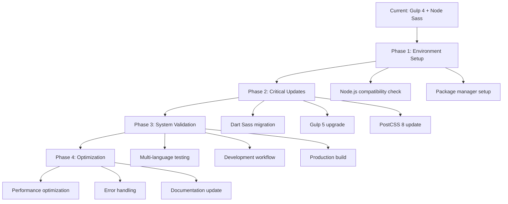

# 🎨 CREATIVE PHASE: Build System Modernization

**Project**: xbonell-vcard Dependency Update
**Phase**: Build Configuration Design  
**Date**: $(date '+%Y-%m-%d %H:%M:%S')
**Complexity**: Level 3 - Intermediate Feature

## PROBLEM STATEMENT

The current build system uses outdated dependencies that are incompatible with Node.js v22.17.1, specifically:

1. **Node Sass Deprecation**: node-sass@4.14.1 is deprecated and incompatible
2. **Major Version Gaps**: Multiple dependencies are 2-3 major versions behind
3. **Build Pipeline Risk**: Updates may break existing SCSS, JavaScript, and static site generation
4. **Multi-language Support**: Must maintain existing en/es/ca content processing
5. **Development Experience**: Need to preserve live reloading and development workflow

**Core Challenge**: How to modernize the build system while maintaining all existing functionality and improving compatibility with current Node.js versions?

🎨🎨🎨 ENTERING CREATIVE PHASE: BUILD ARCHITECTURE 🎨🎨🎨

## OPTIONS ANALYSIS

### Option 1: Incremental Migration (Conservative)
**Description**: Update dependencies in small batches, testing each change thoroughly
**Approach**:
- Phase 1: Fix critical Node Sass issue only
- Phase 2: Update Gulp and related plugins
- Phase 3: Update remaining dependencies
- Phase 4: Optimize and modernize

**Pros**:
- Lower risk of breaking changes
- Easier to isolate and fix issues
- Maintains development velocity
- Clear rollback points at each phase

**Cons**:
- Longer overall timeline
- Multiple testing cycles required
- May miss optimization opportunities
- Still leaves some compatibility issues unresolved

**Complexity**: Medium
**Implementation Time**: 2-3 weeks
**Risk Level**: Low

### Option 2: Complete Modern Stack Migration (Progressive)
**Description**: Migrate to a completely modern build stack while maintaining functionality
**Approach**:
- Replace Gulp with Vite/Rollup for modern bundling
- Migrate from Browserify to native ES modules
- Update to latest Sass, PostCSS, and optimization tools
- Maintain Metalsmith for static site generation
- Add modern development features (HMR, fast refresh)

**Pros**:
- Future-proof architecture
- Better performance and development experience
- Modern tooling ecosystem
- Improved build speeds
- Better debugging and error reporting

**Cons**:
- High risk of breaking changes
- Requires significant configuration rewrite
- Learning curve for new tools
- Potential compatibility issues with existing plugins

**Complexity**: High
**Implementation Time**: 4-6 weeks
**Risk Level**: High

### Option 3: Hybrid Modernization (Balanced)
**Description**: Keep Gulp as task runner but modernize all dependencies and add modern features
**Approach**:
- Update Gulp to v5 with modern plugin ecosystem
- Replace Node Sass with Dart Sass
- Update all dependencies to latest compatible versions
- Add modern development features where possible
- Maintain existing task structure and workflows

**Pros**:
- Balanced risk vs. benefit
- Preserves familiar workflow
- Significant modernization benefits
- Maintains existing configuration patterns
- Good compatibility with current setup

**Cons**:
- Still tied to Gulp ecosystem
- Some legacy patterns remain
- May not achieve maximum performance gains
- Requires careful dependency compatibility management

**Complexity**: Medium-High
**Implementation Time**: 3-4 weeks
**Risk Level**: Medium

🎨 CREATIVE CHECKPOINT: Options Evaluated 🎨

## DECISION RATIONALE

**Selected Option**: **Option 3 - Hybrid Modernization (Balanced)**

**Primary Reasons**:

1. **Risk Management**: Provides substantial modernization while maintaining manageable risk
2. **Familiarity**: Preserves the Gulp workflow that's already established and working
3. **Compatibility**: Maintains compatibility with existing HAML templates and Metalsmith
4. **User Preference**: Aligns with user preference for dependency-free solutions where possible
5. **Timeline**: Achievable timeline with clear milestones

**Key Decision Points**:
- Keep Gulp 5 as the foundation (familiar, stable, well-documented)
- Migrate to Dart Sass for SCSS processing (mandatory for Node.js compatibility)
- Update all dependencies to latest stable versions
- Preserve existing task structure and development workflow
- Add modern optimizations within the Gulp ecosystem

## IMPLEMENTATION ARCHITECTURE

### Core Technology Stack (Updated)
```
Build System: Gulp 5.x
├── CSS Processing: Dart Sass (sass package)
├── JavaScript: Browserify 17 + Babel 8
├── Static Site: Metalsmith (maintained)
├── Development: Browser-sync 3.x
└── Optimization: Modern PostCSS 8 ecosystem
```

### Migration Strategy


### Critical Migration Points

1. **SCSS Processing Migration**
   ```javascript
   // OLD: gulp-sass with node-sass
   const sass = require('gulp-sass');
   sass.compiler = require('node-sass');
   
   // NEW: gulp-sass with dart sass
   const sass = require('gulp-sass')(require('sass'));
   ```

2. **Gulp Task Structure (Maintained)**
   ```javascript
   // Preserve existing task structure
   gulp.task('css', () => { /* updated implementation */ });
   gulp.task('html', () => { /* maintained */ });
   gulp.task('build', gulp.series('clean', gulp.parallel('css', 'html', 'js')));
   ```

3. **PostCSS Plugin Updates**
   ```javascript
   // Updated plugin configuration for PostCSS 8
   const postcssPlugins = [
     autoprefixer(), // v10+
     cssnano({ preset: 'default' }), // v7+
     combineMediaQuery() // v2+
   ];
   ```

### Development Workflow (Preserved)
- `npm run dev` - Development server with live reload
- `npm run build` - Production build with optimization
- Multi-language content processing maintained
- HAML template processing preserved
- SVG sprite generation maintained

🎨 CREATIVE CHECKPOINT: Architecture Designed 🎨

## RISK MITIGATION STRATEGIES

### 1. Node Sass → Dart Sass Migration
**Risk**: SCSS compilation differences
**Mitigation**:
- Create test suite for all existing SCSS modules
- Validate output CSS matches current production
- Test with all three language variants (en/es/ca)
- Maintain existing SCSS file structure

### 2. Gulp 5 Breaking Changes
**Risk**: Task runner failures
**Mitigation**:
- Review Gulp 5 migration guide thoroughly
- Test each task individually during migration
- Maintain backward compatibility in task definitions
- Create comprehensive task testing suite

### 3. PostCSS 8 Ecosystem Changes
**Risk**: CSS processing pipeline failures
**Mitigation**:
- Update all PostCSS plugins simultaneously
- Test autoprefixer with current browserslist configuration
- Validate media query combining functionality
- Verify cssnano optimization settings

### 4. Development Workflow Disruption
**Risk**: Developer experience degradation
**Mitigation**:
- Preserve all existing npm scripts
- Maintain browser-sync live reloading
- Test development server functionality
- Document any workflow changes

## TESTING STRATEGY

### 1. Unit Testing (Per Component)
- SCSS compilation (each module)
- JavaScript bundling (each script)
- Template processing (each language)
- SVG sprite generation
- Image optimization

### 2. Integration Testing
- Complete development build
- Complete production build
- Multi-language site generation
- Asset optimization pipeline

### 3. Environment Testing
- Linux WSL2 (primary environment)
- Node.js v22.17.1 compatibility
- Yarn vs npm compatibility

## SUCCESS METRICS

### Functional Requirements
- [ ] All existing functionality preserved
- [ ] Multi-language support maintained (en/es/ca)
- [ ] Development server with live reload working
- [ ] Production build with optimization working
- [ ] HAML template processing functional
- [ ] SVG sprite generation working
- [ ] Image optimization pipeline functional

### Technical Requirements
- [ ] Node.js v22.17.1 compatibility achieved
- [ ] All dependencies updated to latest stable
- [ ] Build performance maintained or improved
- [ ] Error handling and reporting improved
- [ ] Development workflow preserved

### Quality Requirements
- [ ] No regression in output quality
- [ ] Build reliability improved
- [ ] Error messages more helpful
- [ ] Documentation updated

🎨🎨🎨 EXITING CREATIVE PHASE - DECISION MADE 🎨🎨🎨

## IMPLEMENTATION PLAN SUMMARY

**Approach**: Hybrid Modernization with Gulp 5 + Dart Sass
**Risk Level**: Medium (Manageable)
**Timeline**: 3-4 weeks
**Key Benefits**: Node.js compatibility, modern dependencies, preserved workflow

**Next Steps**:
1. Begin technology validation with hello world proof of concept
2. Create test environment for dependency updates
3. Execute phased migration plan
4. Comprehensive testing and validation

This creative phase provides the architectural foundation for implementing the dependency updates while balancing modernization benefits with implementation risk.
